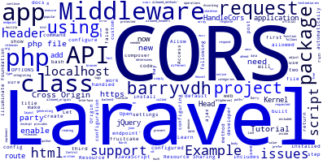

# version_control
<!-- welcome to out redme file -->
# my name is sazzad
## my name is sazzad
---
---
### my father name is saz
#### whatever we are do
##### nothing to say
###### oh shit

we are success  
<br>
to do something
<h1>We are do something</h1>

~~ we are do some strike ~~
```
pwer of idea do more use more
```

`https://facebook.com`  
https://facebook.com

### Order list
1. my name is sazzad
    1. my name is sazzad
        1. my name is sazzad
    1. my name is sazzad
1. my name is sazzad
1. my name is sazzad

### UnOrder list
- my name is sazzad
    - my name is sazzad
        - my name is sazzad
    - my name is sazzad
- my name is sazzad
- my name is sazzad

---
# html code block
```html
<html>
    <head>
        <link rel="stylesheet" href="style.css">
    </head>
    <body>
        <div class="container">
            We are do fine
        </div>
    </body>
</html>
```

```javascript
console.log('we are do something');
```

```php
$my="this is string";
echo $my;
function my($my){
    return $my;
}
```

```python
print("something work good")
```

```swift
print("do something")
```
```css
h1{
    text-align:center;
    text-transform:uppercase;
}
```





[facebook]( https://facebook.com)  

